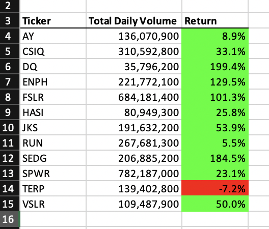
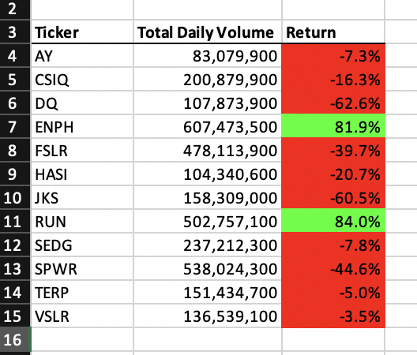

# stock-analysis

## Overview

The purpose of this study and analysis is to provide relevant data to a client interested in comparing the success and failure rates of stocks.

## Results

According to the data generated, 2017 had a much better rate of return versus 2018.

