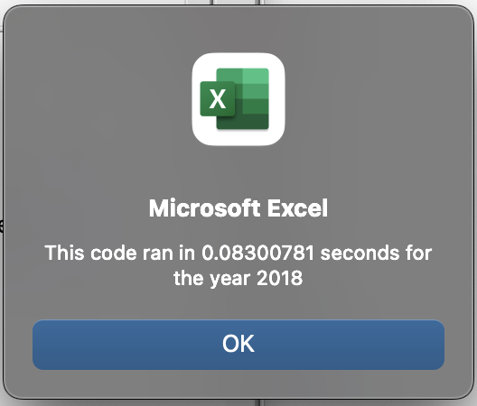

# stock-analysis

## Overview

The purpose of this study and analysis is to provide relevant data to a client interested in comparing the success and failure rates of stocks.

## Results

According to the data generated, 2017 had a much better rate of return versus 2018, as seen in the pictures below. These tables provide the necessary information for our client to make decisions based on the initial question posed, as well as giving the worksheets more capability for future adjustments, such as year range according to future potential needs of the client.

Additionally, when we compare the time it took our original script to loop through the data versus our refractored script, we can see that it did take less time with the refractored script generating through the loop.

## Data for 2018
Original Script

Refractored Script

## Data for 2017
Orignial Script

Refractored Script

## Code for refractored script

## Advantages and Disadvantages

Refractoring code, while making existing code more efficient, can also be time consuming for the person doing it for already working code, as it involves trying to streamline and remove unnecessary steps in a script.

In the case of this particular analysis, refractoring the original script did make the operation run faster and reduce the length of the macro from condensing steps and joining code. It can, however, be difficult and time consuming for individuals to refractor the script by trying to figure what can be taken out or adjusted to be more streamlined.
